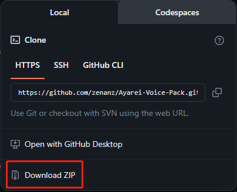

# Ayarei-Voice-Pack

[English](README.md) | 中文

献给世界上最伟大的狐人，绫零。 \
Voice pack dedicated to Ayarei, the greatest Vulpera of all time.

## 安装指南

1. 点击右上角绿色的 ''code'' 按钮并点击 ''Download ZIP''。

     

2. 解压下载到的 _.zip_ 文件. 打开解压出来的文件夹并将其中的子文件夹 _Ayarei_ 移动到魔兽世界客户端根目录下的 _Interface_ 文件夹中。
3. 打开 _WA.txt_, 将其中的字符串导入至游戏内的 _WeakAura_ 插件。

## 功能一览

- 可调节的低血量警报，默认为低于25%最大生命值时触发
- 群体控制警报
- 死亡播报 （怪叫）

## 待办事项
此项目仍在积极开发中，汉堡们的积极贡献至关重要！
- [ ] 增加更多语言！